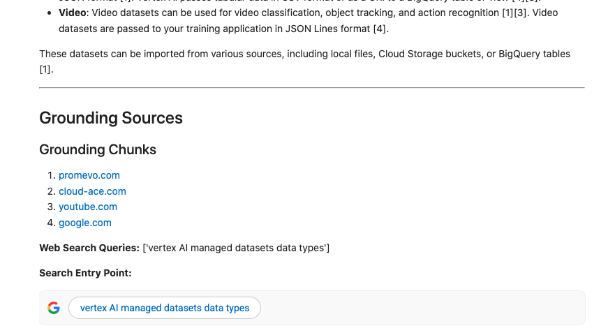

# GCP-LAB-Grounding-Gemini-Models-in-Vertex-AI
Grounding Gemini Models in Vertex AI

#### Overview
Grounding in Vertex AI lets you use generative text models to generate content grounded in your own documents and data. This capability lets the model access information at runtime that goes beyond its training data. By grounding model responses in Google Search results or data stores within Vertex AI Search, LLMs that are grounded in data can produce more accurate, up-to-date, and relevant responses.

Grounding provides the following benefits:

Reduces model hallucinations (instances where the model generates content that isn't factual) Anchors model responses to specific information, documents, and data sources Enhances the trustworthiness, accuracy, and applicability of the generated content

You can configure two different sources of grounding in Vertex AI:

1. Google Search results for data that is publicly available and indexed.

. If you use this service in a production application, you will also need to use a Google Search entry point.

2. Data stores in Vertex AI Search, which can include your own data in the form of website data, unstructured data, or structured data


#### Gemini
Gemini is a family of powerful generative AI models developed by Google DeepMind, capable of understanding and generating various forms of content, including text, code, images, audio, and video.

##### Gemini API in Vertex AI
The Gemini API in Vertex AI provides a unified interface for interacting with Gemini models. This allows developers to easily integrate these powerful AI capabilities into their applications. For the most up-to-date details and specific features of the latest versions, please refer to the official Gemini documentation.

##### Gemini Models
- Gemini Pro: Designed for complex reasoning, including:
. Analyzing and summarizing large amounts of information.
. Sophisticated cross-modal reasoning (across text, code, images, etc.).
. Effective problem-solving with complex codebases.

- Gemini Flash: Optimized for speed and efficiency, offering:
. Sub-second response times and high throughput.
. High quality at a lower cost for a wide range of tasks.
. Enhanced multimodal capabilities, including improved spatial understanding, new output modalities (text, audio, images), and native tool use (Google Search, code execution, and third-party functions).

##### Prerequisites

Before starting this lab, you should be familiar with:

. Basic Python programming.
. General API concepts.
. Running Python code in a Jupyter notebook on Vertex AI Workbench.


#### Objectives

In this lab, you learn how to:

. Generate LLM text and chat model responses grounded in Google Search results.
. Compare the results of ungrounded LLM responses with grounded LLM responses.
. Create and use a data store in Vertex AI Search to ground responses in custom documents and data.
. Generate LLM text and chat model responses grounded in Vertex AI Search results.


### Task 1. Open the notebook in Vertex AI Workbench
In the Google Cloud console, on the Navigation menu (Navigation menu icon), click Vertex AI > Workbench.

Find the vertex-ai-jupyterlab instance and click on the Open JupyterLab button.

The JupyterLab interface for your Workbench instance opens in a new browser tab.


### Task 2. Set up the notebook
Open the intro-grounding-gemini file.

In the Select Kernel dialog, choose Python 3 from the list of available kernels.

Run through the Getting Started and the Import libraries sections of the notebook.

For Project ID, use qwiklabs-gcp-00-002e9a00c84f, and for Location, use us-central1.


Overview
YouTube Video: Introduction to grounding with Gemini on Vertex AI

Introduction to grounding with Gemini on Vertex AI
Grounding in Vertex AI lets you use generative text models to generate content grounded in your own documents and data. This capability lets the model access information at runtime that goes beyond its training data. By grounding model responses in Google Search results or data stores within Vertex AI Search, LLMs that are grounded in data can produce more accurate, up-to-date, and relevant responses.

Grounding provides the following benefits:

Reduces model hallucinations (instances where the model generates content that isn't factual)
Anchors model responses to specific information, documents, and data sources
Enhances the trustworthiness, accuracy, and applicability of the generated content
You can configure two different sources of grounding in Vertex AI:

Google Search results for data that is publicly available and indexed.
If you use this service in a production application, you will also need to use a Google Search entry point.
Data stores in Vertex AI Search, which can include your own data in the form of website data, unstructured data, or structured data

Objective
In this tutorial, you learn how to:

Generate LLM text and chat model responses grounded in Google Search results
Compare the results of ungrounded LLM responses with grounded LLM responses
Create and use a data store in Vertex AI Search to ground responses in custom documents and data
Generate LLM text and chat model responses grounded in Vertex AI Search results
This tutorial uses the following Google Cloud AI services and resources:

Vertex AI
Vertex AI Search
The steps performed include:

Configuring the LLM and prompt for various examples
Sending example prompts to generative text and chat models in Vertex AI
Setting up a data store in Vertex AI Search with your own data
Sending example prompts with various levels of grounding (no grounding, web grounding, data store grounding)


Before you begin
Set up your Google Cloud project
The following steps are required, regardless of your notebook environment.

Select or create a Google Cloud project. When you first create an account, you get a $300 free credit towards your compute/storage costs.
Make sure that billing is enabled for your project.
Enable the Vertex AI and Vertex AI Search APIs.
If you are running this notebook locally, you need to install the Cloud SDK.


##### Install Google Gen AI SDK for Python
Install the following packages required to execute this notebook.

`%pip install --upgrade --quiet google-genai`

##### Set Google Cloud project information and create client
To get started using Vertex AI, you must have an existing Google Cloud project and enable the Vertex AI API.

Learn more about setting up a project and a development environment.

If you don't know your project ID, try the following:

Run gcloud config list.
Run gcloud projects list.
See the support page: Locate the project ID
You can also change the LOCATION variable used by Vertex AI. Learn more about Vertex AI regions.

```
import os

PROJECT_ID = "qwiklabs-gcp-00-002e9a00c84f"  # @param {type: "string"}
if not PROJECT_ID or PROJECT_ID == "qwiklabs-gcp-00-002e9a00c84f":
    PROJECT_ID = str(os.environ.get("GOOGLE_CLOUD_PROJECT"))

LOCATION = os.environ.get("GOOGLE_CLOUD_REGION", "us-central1")

from google import genai

client = genai.Client(vertexai=True, project=PROJECT_ID, location=LOCATION)
```

#### Import libraries

```
from IPython.display import Markdown, display
from google.genai.types import (
    GenerateContentConfig,
    GenerateContentResponse,
    GoogleSearch,
    Part,
    Retrieval,
    Tool,
    VertexAISearch,
)
```

#### Helper functions

```
def print_grounding_data(response: GenerateContentResponse) -> None:
    """Prints Gemini response with grounding citations in Markdown format."""
    if not (response.candidates and response.candidates[0].grounding_metadata):
        print("Response does not contain grounding metadata.")
        display(Markdown(response.text))
        return

    grounding_metadata = response.candidates[0].grounding_metadata
    markdown_parts = []

    # Citation indexes are in bytes
    ENCODING = "utf-8"
    text_bytes = response.text.encode(ENCODING)
    last_byte_index = 0

    for support in grounding_metadata.grounding_supports:
        markdown_parts.append(
            text_bytes[last_byte_index : support.segment.end_index].decode(ENCODING)
        )

        # Generate and append citation footnotes (e.g., "[1][2]")
        footnotes = "".join([f"[{i + 1}]" for i in support.grounding_chunk_indices])
        markdown_parts.append(f" {footnotes}")

        # Update index for the next segment
        last_byte_index = support.segment.end_index

    # Append any remaining text after the last citation
    if last_byte_index < len(text_bytes):
        markdown_parts.append(text_bytes[last_byte_index:].decode(ENCODING))

    markdown_parts.append("\n\n----\n## Grounding Sources\n")

    # Build Grounding Sources Section
    markdown_parts.append("### Grounding Chunks\n")
    for i, chunk in enumerate(grounding_metadata.grounding_chunks, start=1):
        context = chunk.web or chunk.retrieved_context
        if not context:
            print(f"Skipping Grounding Chunk without context: {chunk}")
            continue

        uri = context.uri
        title = context.title or "Source"

        # Convert GCS URIs to public HTTPS URLs
        if uri and uri.startswith("gs://"):
            uri = uri.replace("gs://", "https://storage.googleapis.com/", 1).replace(
                " ", "%20"
            )
        markdown_parts.append(f"{i}. [{title}]({uri})\n")

    # Add Search/Retrieval Queries
    if grounding_metadata.web_search_queries:
        markdown_parts.append(
            f"\n**Web Search Queries:** {grounding_metadata.web_search_queries}\n"
        )
        if grounding_metadata.search_entry_point:
            markdown_parts.append(
                f"\n**Search Entry Point:**\n{grounding_metadata.search_entry_point.rendered_content}\n"
            )
    elif grounding_metadata.retrieval_queries:
        markdown_parts.append(
            f"\n**Retrieval Queries:** {grounding_metadata.retrieval_queries}\n"
        )

    display(Markdown("".join(markdown_parts)))

```

Initialize the Gemini model from Vertex AI:


`MODEL_ID = "gemini-2.0-flash"  # @param {type: "string"}`


### Task 3. Grounding with Google Search results
Run the Example: Grounding with Google Search results section of the notebook.

##### Example: Grounding with Google Search results
In this example, you'll compare LLM responses with no grounding with responses that are grounded in the results of a Google Search. You'll ask a question about a the most recent solar eclipse.

`PROMPT = "When is the next solar eclipse in the US?"`

##### Text generation without grounding¶
Make a prediction request to the LLM with no grounding:

```
response = client.models.generate_content(
    model=MODEL_ID,
    contents=PROMPT,
)

display(Markdown(response.text))
```

>The next solar eclipse in the US will be an annular solar eclipse on October 14, 2023. However, for a total solar eclipse, you'll have to wait until April 8, 2024. This will be a much more dramatic event.

##### Text generation grounded in Google Search results
You can add the tools keyword argument with a Tool including GoogleSearch to instruct Gemini to first perform a Google Search with the prompt, then construct an answer based on the web search results.

The search queries and Search Entry Point are available for each Candidate in the response.


```
google_search_tool = Tool(google_search=GoogleSearch())

response = client.models.generate_content(
    model=MODEL_ID,
    contents=PROMPT,
    config=GenerateContentConfig(tools=[google_search_tool]),
)

print_grounding_data(response)
```


Text generation with multimodal input grounded in Google Search results
Gemini can also generate grounded responses with multimodal input. Let's try with this image of the Eiffel Tower.

Paris

```
PROMPT = "What is the current temperature at this location?"

response = client.models.generate_content(
    model=MODEL_ID,
    contents=[
        Part.from_uri(
            file_uri="gs://github-repo/generative-ai/gemini/grounding/paris.jpg",
            mime_type="image/jpeg",
        ),
        PROMPT,
    ],
    config=GenerateContentConfig(
        tools=[google_search_tool],
    ),
)

print_grounding_data(response)
```

>I am unable to provide you with the current temperature for the location in the image. To get that information, you would need to know the specific city and then check a weather service. The current temperature in Paris, France, is around 16°C (60°F) [1]. It feels like 15°C (59°F) [1]. The weather is partly cloudy with a 0% chance of rain [1].


#### Example: Grounding with Enterprise Web Search
Grounding with Google Search uses Google Search to perform searches across the web. As part of this offering, Google Search might perform logging of customer queries (see section 19.k of Google Cloud Service Specific Terms). This often doesn't meet the compliance requirements of customers in highly regulated industries like Finance or Healthcare.

Enterprise Web Search meets these requirements. When a customer uses Enterprise Web Search to ground on the web, this is done without logging of customer data and with full support for VPC SC and ML processing in-region. Enterprise Web Search Grounding is available in an US and EU multi-region.

Request and response format for Enterprise Web Search Grounding are very similar to Grounding with Google Search.

##### Gemini model compatibility
Enterprise Web Search is compatible with all Gemini models. Gemini 2.0 Flash supports multimodal input (e.g. images, documents, videos).


```
%%bash -s "$PROJECT_ID" "$MODEL_ID"
PROJECT_ID=$1
MODEL_ID=$2
curl -X POST \
  -H "Authorization: Bearer $(gcloud auth print-access-token)" \
  -H "Content-Type: application/json" \
  -H "x-server-timeout: 60" \
  https://us-central1-aiplatform.googleapis.com/v1/projects/$PROJECT_ID/locations/us-central1/publishers/google/models/$MODEL_ID:generateContent \
  -d '{
    "contents": [{
      "role": "user",
      "parts": [{
        "text": "Who won the 2024 UEFA European Championship?"
      }]
    }],
    "tools": [{
      "enterpriseWebSearch": {}
    }]
  }'

```


### Task 4. Create a Vertex AI Datastore
In this section, you will create a Vertex AI Datastore in Cloud Console.

1. In the top search box, enter AI Applications and select AI Applications from the results.

2. On the Welcome to AI Applications landing page click CONTINUE AND ACTIVATE THE API.

3. Go to the Data Stores > Create data store page.


4. In the Select a data source pane, select Cloud Storage.

5. In the Import data from Cloud Storage pane, select Unstructured documents (PDF, HTML, TXT and more).

6. Make sure Folder is selected

7. In the gs:// field, enter the following value and click Continue:

cloud-samples-data/gen-app-builder/search/cymbal-bank-employee

8. In the Configure your data store pane, select global (Global) as the location for your data store.

9. Enter a name for your data store. Note the ID that is generated. You'll need this later.

10. Click Create.


### Task 5. Create a Vertex AI Search Application
In this section, you will create a Vertex AI Search Application in Cloud Console.

1. Go to the Apps > Create App page.


2. On the Create App page, under Search for your website, click Create.

3. Make sure that Enterprise edition features is turned on.

4. In the Your app name field, enter a name for your app. Your app ID appears under the app name.

5. In the External name of your company or organization field, enter the company or organization name. For this tutorial, you can use Google Cloud, because the app will search a Google Cloud website.

6. Select global (Global) as the location for your app, and then click Continue.


7. In the list of data stores, select the data store that you created earlier, and then click Create.


##### Example: Grounding with custom documents and data
In this example, you'll compare LLM responses with no grounding with responses that are grounded in the results of a search app in Vertex AI Search.

The data store will contain internal documents from a fictional bank, Cymbal Bank. These documents aren't available on the public internet, so the Gemini model won't have any information about them by default.


###### Creating a data store in Vertex AI Search
In this example, you'll use a Google Cloud Storage bucket with a few sample internal documents for our bank. There's some docs about booking business travel, strategic plan for this Fiscal Year and HR docs describing the different jobs available in the company.

Follow the tutorial steps in the Vertex AI Search documentation to:

Create a data store with unstructured data that loads in documents from the GCS folder gs://cloud-samples-data/gen-app-builder/search/cymbal-bank-employee.
Create a search app that is attached to that data store. You should also enable the Enterprise edition features so that you can search indexed records within the data store.
Note: The data store must be in the same project that you are using for Gemini.

You can also follow this notebook to do it with code. Create a Vertex AI Search Datastore and App

Once you've created a data store, obtain the App ID and input it below.

Note: You will need to wait for data ingestion to finish before using a data store with grounding. For more information, see create a data store.


```
VERTEX_AI_SEARCH_PROJECT_ID = PROJECT_ID  # @param {type: "string"}
VERTEX_AI_SEARCH_REGION = "global"  # @param {type: "string"}
# Replace this with your App (Engine) ID from Vertex AI Search
VERTEX_AI_SEARCH_APP_ID = "mylabapp_1746636434332"  # @param {type: "string"}

VERTEX_AI_SEARCH_ENGINE_NAME = f"projects/{VERTEX_AI_SEARCH_PROJECT_ID}/locations/{VERTEX_AI_SEARCH_REGION}/collections/default_collection/engines/{VERTEX_AI_SEARCH_APP_ID}"

```

Now you can ask a question about the company culture:

`PROMPT = "What is the company culture like?"`

##### Text generation without grounding
Make a prediction request to the LLM with no grounding:

```
response = client.models.generate_content(
    model=MODEL_ID,
    contents=PROMPT,
)

display(Markdown(response.text))
```


### Task 6. Grounding with custom documents and data
Run through the Example: Grounding with custom documents and data section of the notebook. Use the datastore ID created in the previous tasks where required.

##### Text generation grounded in Vertex AI Search results
Now we can add the tools keyword arg with a grounding tool of grounding.VertexAISearch() to instruct the LLM to first perform a search within your search app, then construct an answer based on the relevant documents:

```
vertex_ai_search_tool = Tool(
    retrieval=Retrieval(
        vertex_ai_search=VertexAISearch(engine=VERTEX_AI_SEARCH_ENGINE_NAME)
    )
)

response = client.models.generate_content(
    model=MODEL_ID,
    contents="What is the company culture like?",
    config=GenerateContentConfig(tools=[vertex_ai_search_tool]),
)

print_grounding_data(response)
```

>Cymbal Bank has a company culture that is fast-paced and results-oriented [1]. The company values collaboration, communication, and teamwork and is always looking for ways to improve and innovate [1]. Cymbal Bank strives to be open-minded, respectful, inclusive, and diverse [2].


Task 7. Grounded chat responses
Run through the Example: Grounded chat responses section of the notebook.


#### Example: Grounded chat responses
You can also use grounding when using chat conversations in Vertex AI. In this example, you'll compare LLM responses with no grounding with responses that are grounded in the results of a Google Search and a data store in Vertex AI Search.


#### Grounding Sources¶
Grounding Chunks
Cymbal Bank New Employee Guide
Cymbal Bank Company Culture
Retrieval Queries: ['company culture']

Note that the response without grounding doesn't have any context about what company we are asking about. Whereas the response that was grounded in Vertex AI Search results contains information from the documents provided, along with citations of the information.


#### Example: Grounded chat responses
You can also use grounding when using chat conversations in Vertex AI. In this example, you'll compare LLM responses with no grounding with responses that are grounded in the results of a Google Search and a data store in Vertex AI Search.

```
PROMPT = "What are managed datasets in Vertex AI?"
PROMPT_FOLLOWUP = "What types of data can I use?"
```

#### Chat session grounded in Google Search results
Now you can add the tools keyword arg with a Tool of GoogleSearch to instruct the chat model to first perform a Google Search with the prompt, then construct an answer based on the web search results:


```
chat = client.chats.create(
    model=MODEL_ID,
    config=GenerateContentConfig(tools=[Tool(google_search=GoogleSearch())]),
)

display(Markdown("## Prompt"))
display(Markdown(f"> {PROMPT}"))
response = chat.send_message(PROMPT)
print_grounding_data(response)

display(Markdown("---\n"))

display(Markdown("## Follow-up Prompt"))
display(Markdown(f"> {PROMPT_FOLLOWUP}"))
response = chat.send_message(PROMPT_FOLLOWUP)
print_grounding_data(response)
```





##### Chat session grounded in Vertex AI Search results
Now we can add the tools keyword arg with a grounding tool of VertexAISearch to instruct the chat session to first perform a search within your custom search app, then construct an answer based on the relevant documents:

```
PROMPT = "How do I book business travel?"
PROMPT_FOLLOWUP = "Give me more details."
```

```
chat = client.chats.create(
    model=MODEL_ID,
    config=GenerateContentConfig(
        tools=[
            Tool(
                retrieval=Retrieval(
                    vertex_ai_search=VertexAISearch(engine=VERTEX_AI_SEARCH_ENGINE_NAME)
                )
            )
        ]
    ),
)

display(Markdown("## Prompt"))
display(Markdown(f"> {PROMPT}"))
response = chat.send_message(PROMPT)
print_grounding_data(response)
```


##### Congratulations!
In this lab, you learned how to ground Large Language Models (LLMs) in both Google Search and custom data sources. By comparing grounded and ungrounded LLM responses, you witnessed the significant impact grounding has on response quality and accuracy. Furthermore, you gained practical experience creating and utilizing a data store in Vertex AI Search, enabling you to ground LLM text and chat models in your own documents and data.

Next steps / learn more
Check out the following resources to learn more about Gemini:

Gemini Overview
Generative AI on Vertex AI Documentation
Generative AI on YouTube
Explore the Vertex AI Cookbook for a curated, searchable gallery of notebooks for Generative AI.
Explore other notebooks and samples in the Google Cloud Generative AI repository.
